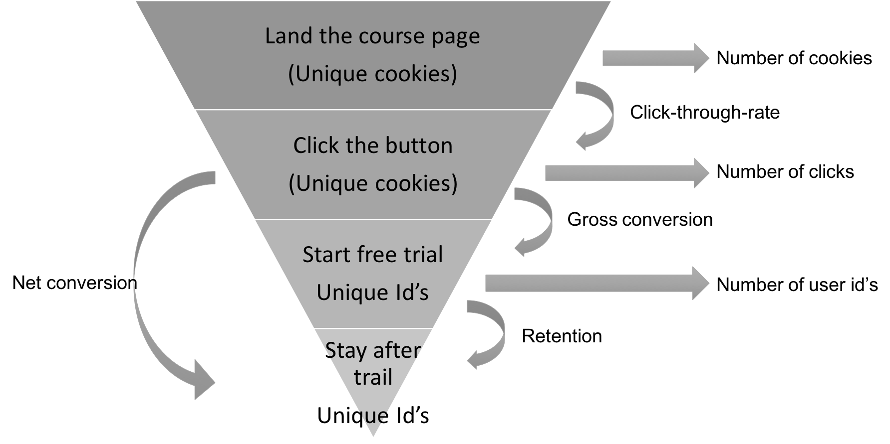

This is the final project of A/B Testing course on Udacity. I performed all the analysis on MS Excel. 

The instruction of this project can be found [here](https://docs.google.com/document/u/1/d/1aCquhIqsUApgsxQ8-SQBAigFDcfWVVohLEXcV6jWbdI/pub?embedded=True).  

Relevant data:  
	- [Data for analysis](https://www.google.com/url?q=https://docs.google.com/a/knowlabs.com/spreadsheets/d/1Mu5u9GrybDdska-ljPXyBjTpdZIUev_6i7t4LRDfXM8/edit%23gid%3D0&sa=D&ust=1592798983966000)    
	- [Baseline value for each metric](https://www.google.com/url?q=https://docs.google.com/a/knowlabs.com/spreadsheets/d/1MYNUtC47Pg8hdoCjOXaHqF-thheGpUshrFA21BAJnNc/edit%23gid%3D0&sa=D&ust=1592798983965000)  
	

# Udacity A/B Testing Final Project Report

Lu Zheng - 2020/06/21

## Metric Choice
The candidate metrics:  

* Number of Cookies  
* Number of user-ids  
* Number of clicks  
* Click-through-probability  
* Gross conversion  
* Retention  
* Net conversion

To figure out which metrics will be used in this project, understanding the whole process is the key. Blow is the conversion funnel of the enrolling process.  

  

Since the enrollment screening is the only thing changed in this experiment, the metrics based on the steps prior to start free trial will not be affected. Therefore, Number of cookies, Click-through-rate, number of clicks should stay unchanged across control and experiment group. Any metric involving start-free-trial and the following steps will move with the change. A tricky metric here is net conversion. Recall one of the hypothesis of this experiment is that through the change, the number of students who continue past the free trial and eventually complete the course is not significantly reduced. That means the number of students who stay after 14-day free trial should keep unchanged in the experiment group, so net conversion should also be evaluated but in a slightly different way. A relatively stable net conversion is expected after the change. In summary, based on the funnel and the hypothesis of the experiment, Number of cookes, Click-through-rate, Number of clicks are identified as invariants, and Gross conversion, Number of user id, Retention, and Net conversion will be affected by the change. 

Are all variants used as evaluation metrics? Not necessarily. Based on the goal of this experiment, number of user_id does not provide useful information, because its change has already reflected in gross conversion for the fact that the decrease in number of user id will lead to the decrease of gross conversion with unchanged number of clicks. As a result, gross conversion, retention and net conversion are evaluation metrics of this experiment.

The gross conversion is expected to decrease, retention is expected to increase, and net conversion should be relatively stable  in order to launch the experiment. 

## Measuring Standard Deviation

The standard deviation is to calculate the sample size of this experiment. It is clear that standard deviation is proportional to $\frac{1}{\sqrt{n}}$. All the three metrics can be considered to follow binomial distribution. Based on the baseline values provided, the standard deviation can be calculated by:
$$ 
std = \sqrt{\frac{p(1-p)}{n}}
$$

Using the baseline values, the standard deviation for each metric is summarized in the table below:  

|   |Gross Conversion   |Retentioin |Net conversion  |
|---|---|---| --- |
|Analytical| 0.0202  |  0.0549  | 0.0156
|Empirical  | 0.0437 |   0.0883 | 0.0266

As shown in the table, the analytical standard deviation is a bit underestimated. There could be multiple reasons for it. For example, in order to calculate the analytical standard deviation, the underlying assumption that has been made is that the distribution of each event is independent and identical, which may not be the case in real-life setting. Observing the data, for some days, the gross conversion is particularly higher than other days, which indicates the distribution may not be identical. 

## Sizing

### Choosing Number of Samples given Power

[Sample Size calculator](https://www.evanmiller.org/ab-testing/sample-size.html)

In section one, gross conversion, retention and net conversion are identified as evaluation metrics. Based on  their baseline values and minimum detectable change, the number of sample needed for each metric is as follows ($\alpha = 95\%; \beta = 0.2$):

|   |Gross Conversion |Retention |Net conversion  |
|---|---|---| --- |
|Baseline value| 0.20625  |  0.53  | 0.1093125
|d_min  | 0.01 |  0.01 | 0.0075
|Size (per group) | 25835 | 39115 | 27411 |  
|Pageviews (total) | 645875 | 4741212 | 342637

Note that the size here does not refer to number of pageviews. For example, for gross conversion, at least 25835 clicks is needed per group, hence $25835*2 = 51670$ clicks for two groups. The baseline gross conversion is 0.08, so number of pageviews needed is $51670 / 0.08=645875$. The same method is used for retention and net conversion. If all three metrics are used, the maximum pageviews should be the size of the experiment, which is 4741212 pageviews.

### Choosing Duration vs. Exposure  

From previous section, it suggests that 4741212 pageviews are needed to guarantee the statistical power of the expeirment. On average, 40,000 pageviews can be collected per day. If 100% of the traffic is diverted to the experiment, the experiment duration is around $4741212 / 40000= 119$ days to collect all data. 119 days is obvious too long for an experiment, to shorten the duration, retention is consider to be dropped. With only gross conversion and net conversion, 645875 pageviews are sufficient. If 100% of the traffic is sent to the experiment, the experiment should run for $645875 / 40000 = 16$ days. Considering the risk of the experiment, diverting 50% of traffic is a safer choice. Therefore, roughly 32 days is needed. 

## Experiment Analysis

### Sanity Checks

Sanity check is performed for number of cookies, number of clicks and click-through-probability. 

|   |Total pageviews |Total number of clicks |Click-through-[robability  |
|---|---|---| --- |
|Control| 345543  |  28378  | 0.0821
|Experiment| 344660 | 28325 | 0.0820
|Probability |0.49936 |0.49953 |0.000097 (the diff) |  
|Standard Error |0.0017 |0.0059 |0.0009
|Confidence Interval |[0.4967, 0.5033] |[0.4884, 0.5116] |[-0.0018, 0.0035]

All values fall within the confidence interval, indicating the invariants pass sanity check. 

(For all computation, please refer to the spreadsheet)

### Result Analysis

#### Effect Size Tests

Effect size test will be performed for gross conversion and net conversion.

|   |Gross Conversion |Net Conversion |
|---|---|---| 
|Control| 0.2189  | 0.1176  | 
|Experiment|0.1983 |0.1127 |
|Difference |-0.0206 |-0.0049 |  
|Pooled metric |0.2086 |0.1151 |
|Pooled std |0.0044 |0.0034 |
|Confidence Interval |[-0.0291,-0.0120] |[-0.0116,0.0019] |
|d_min |0.01 |0.0075 |
| statistically significant? |Yes | No 
| practically significant? |Yes | No

For gross conversion, neither 0 and d_min is included in the confidence interval, so it is statistically and practically significant.

For net conversion, 0 is included and d_min is not within the confidence interval, so it is neither statistically nor practically significant. 

#### Sign Test 

[Sign Test tool](https://www.graphpad.com/quickcalcs/binomial1.cfm)

|   |Gross Conversion |Net Conversion |
|---|---|---| 
|Number of trail|23  |23  | 
|Number of success|19 | 10|
|P-value| 0.0026 |0.6776|

The P value for gross conversion suggests that there is a very small chance that this result comes as a coincidence, while the p value for net conversion suggests that it is very likely for the results to happen by chance. The sign test agrees with the effect size test.
